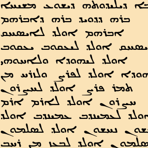

# Syriac New Testament

### BHSA Family

* [bhsa](https://github.com/etcbc/bhsa) Core data and feature documentation
* [phono](https://github.com/etcbc/phono) Phonological representation of Hebrew words
* [parallels](https://github.com/etcbc/parallels) Links between similar verses
* [valence](https://github.com/etcbc/valence) Verbal valence for all occurrences
  of some verbs
* [trees](https://github.com/etcbc/trees) Tree structures for all sentences
* [bridging](https://github.com/etcbc/bridging) Open Scriptures morphology
  ported to the BHSA
* [pipeline](https://github.com/etcbc/pipeline) Generate the BHSA and SHEBANQ
  from internal ETCBC data files
* [shebanq](https://github.com/etcbc/shebanq) Engine of the
  [shebanq](https://shebanq.ancient-data.org) website

### Extended family

* [dss](https://github.com/etcbc/dss) Dead Sea Scrolls
* [extrabiblical](https://github.com/etcbc/extrabiblical)
  Extra-biblical writings from ETCBC-encoded texts
* [peshitta](https://github.com/etcbc/peshitta)
  Syriac translation of the Hebrew Bible
* [syrnt](https://github.com/etcbc/syrnt)
  Syriac translation of the New Testament

# Syriac

The Syriac New Testament is considered part of the Peshitta.
See [Wikipedia](https://en.wikipedia.org/wiki/Peshitta#New_Testament_Peshitta).

However, we treat the Syriac New Testament and the (Old Testament) Peshitta as two different corpora.

# SyrNT in Text-Fabric

This repo is a research environment for the study of the Syriac New Testament.
You can run your own programs off-line, and publish your work in online notebooks.
To that end, the plain text of the Peshitta has brought into the Text-Fabric format,
which lends itself for easy data processing.

# Corpus

The source data in this repo is a
[SEDRA](https://sedra.bethmardutho.org/about/sedra) database export
made by George A. Kiraz and James W. Bennett.

See also [about](docs/about.md).

# Software

The main processing tool is [Text-Fabric](docs/textfabric.md). It is instrumental to
turn the analysis of ancient data into computing narratives.

The ecosystem is Python and Jupyter notebooks.

# Getting started

Start with the
[tutorial](https://nbviewer.jupyter.org/github/annotation/tutorials/blob/master/syrnt/start.ipynb).

# Authors

*   [Hannes Vlaardingerbroek](https://leidenuniv.academia.edu/hvlaardingerbroek)
*   [Dirk Roorda](https://github.com/dirkroorda)

with the help of the
[Eep Talstra Centre for Bible and Computer](http://etcbc.nl), VU University Amsterdam.

**N.B.:** Releases of this repo have been archived at [Zenodo](https://zenodo.org).
Click the DOI badge to be taken to the archive. There you find ways to cite this work.

# Status

*   2018-10-17 SyrNT as a full-blown Text-Fabric [app](https://dans-labs.github.io/text-fabric/Api/Apps/).
    Archived at Zenodo.
